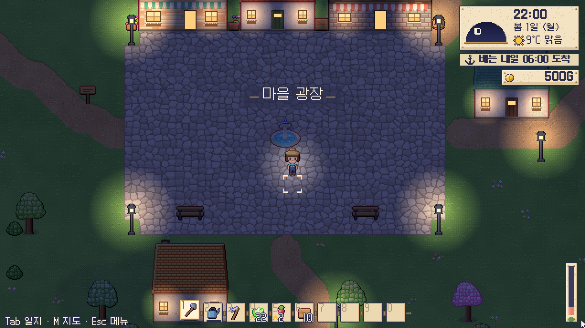

# 루미나 아일 (Lumina Isle)

> 등대 불빛 아래, 작은 섬에서 작물을 기르고 상자에 담아 배로 실어 보내는 낭만 픽셀 농장 게임
> LumaRune Studio · 스팀 출시 목표 · 1~4인 협동(예정)


| 농장 | 씨앗 상점 | 항구 |
| --- | --- | --- |
|  |  |  |
| **밤의 광장** | **등대 곶** | **캐릭터 만들기** |
|  |  |  |

## 핵심 사이클

씨앗 상점에서 씨앗 구매 → 괭이로 밭 갈기 → 심기 → 물주기(날씨 대응) → 수확(★1~5 품질) →
포장대에서 **출하 상자**에 담기 → 상자를 들고 **부두의 화물선**까지 운반 → 17:00 출항 때 정산 →
더 좋은 씨앗·스프링클러·영양제·비가림막 구매

## 특징

- **실제 작물 200종**: 적정 기온, 물 요구량, **비 내성**(토마토·딸기·체리는 비에 약하고 벼·미나리는 비를 좋아함),
  서리 내성, 덩굴 지지대, 다년생, 습지 작물. 등급이 높을수록 비싸고 까다로움.
- **기온 기반 계절**: 매일의 기온·일교차·날씨(맑음·흐림·비·폭풍·안개·눈, 장마)로 생장이 결정되고 서리가 내리면 약한 작물이 시듦.
- **시세**: 한꺼번에 많이 팔면 값이 내려가고 매일 회복, 제철이 아니면 비쌈.
- **큰 섬 (240×180 타일)**: 농장, 마을 광장(씨앗방·공방), 항구, 등대 곶, 강과 다리, 숲, 별빛 언덕, 노을 해변.
- **낭만적인 연출**: 시간대 색보정, 가로등·창문 불빛, 회전하는 등대 빛줄기, 구름 그림자, 벚꽃잎·낙엽·반딧불이, 비·폭풍·안개·눈.
- **항해 일지 UI**: 하늘 다이얼(시간·날씨·기온·출항 카운트다운), 로프 핫바, 씨앗 봉투 카드, 작물 도감 200종, 출하 기록, 섬 지도.
- **캐릭터 커스터마이즈**: 16×32 레이어 도트(헤어 6·옷 4·모자 4·피부 8·머리색 10·눈 6·옷/하의 색), 6프레임 걷기.
- **사운드**: 실제 녹음 샘플로 하나씩 제작한 효과음 33개·환경음 6개·직접 작곡한 음악 5곡.

## 실행

```bash
npm install
npm run dev          # http://localhost:5173 — 싱글플레이 (서버가 Web Worker 안에서 실행)
```

- 이동 `WASD` · 도구 사용 `좌클릭/Space` · 상호작용·수확 `우클릭/E` · 핫바 `1~0`/휠 · 일지 `Tab` · 지도 `M` · 메뉴 `Esc`
- 개발 모드 전용 키: `F1` 날씨 변경, `F2` 1시간 경과, `F3` 작물 다 자라기, `F4` 골드 +5000

```bash
npm run server       # 협동용 전용 서버 (ws://localhost:7777, saves/ 에 저장)
# 클라이언트에서  http://localhost:5173/?server=ws://localhost:7777
npm run check        # 타입체크 + 단위 테스트
npm run build        # 배포용 빌드 → packages/client/dist
npm run audio        # 사운드 에셋 다시 제작 → packages/client/public/audio
```

## 구조 (모듈 · 서버 · 클라이언트)

```
packages/core     @lumina/core    순수 규칙·데이터 (작물 200종, 섬 생성, 날씨, 생장, 경제, 프로토콜)
packages/server   @lumina/server  권한 있는 시뮬레이션 (Web Worker / Node WebSocket, 세이브)
packages/client   @lumina/client  픽셀 렌더러, UI, 입력, 오디오 재생, 씬
tools/audio                       사운드 제작 도구 (녹음 샘플 → 편집 → OGG)
docs/design                       설계도
```

자세한 내용은 [설계도](docs/design/README.md)를 참고하세요.

## 라이선스 고지

폰트·사운드 원재료 등 서드파티 자산은 [THIRD_PARTY_NOTICES.md](THIRD_PARTY_NOTICES.md)에 정리했습니다.
